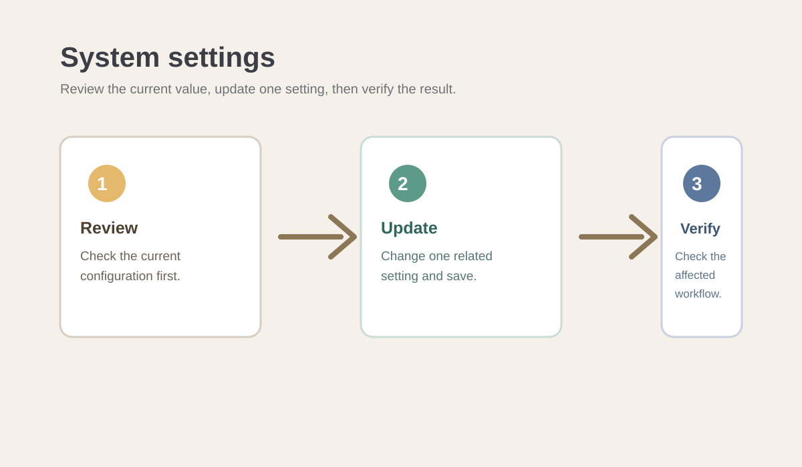

# Manage System Settings

## Contents

- [Introduction](#introduction)
- [Prerequisites](#prerequisites)
- [System settings overview](#system-settings-overview)
- [Frequently Asked Questions](#frequently-asked-questions)
- [Troubleshooting](#troubleshooting)
- [Best Practices](#best-practices)

## Introduction

System settings control behavior across Verve. This quick start guide explains how to review and update Verve-wide settings while keeping changes predictable for users and projects.



## Prerequisites

- Sign in to Verve with an administrator account.
- Identify the setting that needs to change and the expected result.
- Notify affected users before changing a setting that changes access or project behavior.

## System settings overview

### Review system settings

1. Open the administration panel.
2. Select **System settings**.
3. Review the current configuration.
4. Note any setting that requires an update.

Review the current values before changing them so you can compare the result afterward.

### Update a system setting

1. Open the administration panel.
2. Select **System settings**.
3. Select the setting you want to change.
4. Enter the new value or choose the new option.
5. Save your changes.

The updated setting applies across Verve according to its scope.

### Verify a setting change

1. Review the saved value in **System settings**.
2. Open a relevant project or user workflow.
3. Confirm that Verve behaves as expected.
4. Record the change if your team maintains an administration log.

The setting change is complete after the expected behavior is confirmed.

Record important changes in a consistent format:

```ini
[system-settings]
setting =
previous_value =
new_value =
reason =
affected_users_or_projects =
verification_result =
administrator =
```

> [!IMPORTANT]
> Make one related change at a time. A single change makes it easier to identify its effect and restore the previous value if needed.

## Frequently Asked Questions

### Who can change system settings?

Administrators can review and update system settings. Contact an administrator if the setting is unavailable to your account.

### When should I change a system setting?

Change a system setting when the current Verve-wide behavior no longer supports your organization's process. Review the impact before saving the change.

## Troubleshooting

### A setting change has no visible effect

Confirm that you saved the change and that you are checking a workflow affected by that setting. Refresh Verve or sign in again if needed.

### A change affects users unexpectedly

Review the setting and restore the previous value if necessary. Notify affected users and contact your support team for help investigating the impact.

## Best Practices

- Review the current value before changing a system setting.
- Make one related change at a time so you can identify its effect.
- Communicate changes that affect users or projects.
- Keep an administration log for important configuration changes.
