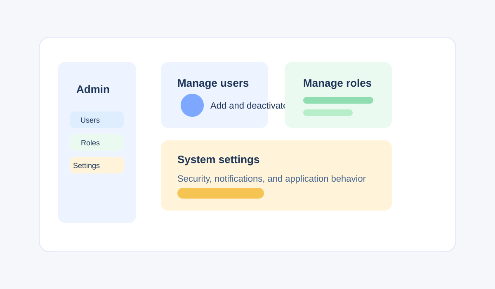

# Manage Roles

## Contents

- [Introduction](#introduction)
- [Prerequisites](#prerequisites)
- [Role administration overview](#role-administration-overview)
- [Frequently Asked Questions](#frequently-asked-questions)
- [Troubleshooting](#troubleshooting)
- [Best Practices](#best-practices)

## Introduction

Use roles in Verve to control access to features and project information. This quick start guide explains how to review roles, assign the appropriate role to a user, and update access when responsibilities change.

## Prerequisites

- Sign in to Verve with an administrator account.
- Review the user's responsibilities before assigning a role.
- Confirm which projects or features the user needs to access.

## Role administration overview



| Role decision | Evidence to review | Result to verify |
| --- | --- | --- |
| Assign a role | User responsibilities and required projects | The user can complete the required work. |
| Change a role | New responsibilities and existing access | Previous access is replaced as expected. |
| Remove access | Responsibilities or project membership have ended | The user no longer has unnecessary access. |

### Review available roles

1. Open the administration panel.
2. Select **Roles**.
3. Review the available roles and their access descriptions.

Use the role descriptions to choose access that matches the user's responsibilities.

Document the access decision before saving it:

```yaml
user: ""
responsibilities: []
required_projects_or_features: []
selected_role: ""
reason: ""
reviewer: ""
```

### Assign a role

1. Open the administration panel.
2. Select **Users**.
3. Select the user who needs access.
4. Select **Edit roles**.
5. Choose the appropriate role.
6. Save your changes.

The user's access is updated according to the selected role.

### Change a user's role

1. Open the administration panel.
2. Select **Users**.
3. Select the user whose access needs to change.
4. Select **Edit roles**.
5. Choose the new role.
6. Save your changes.

The new role replaces the user's previous access settings.

## Frequently Asked Questions

### Which role should I assign?

Choose the role that provides the access the user needs to complete their work. Avoid granting additional access without a clear business need.

### When should I review a user's role?

Review the role when the user's responsibilities, team, or project assignments change.

## Troubleshooting

### The user cannot access a project

Confirm that the user has an active account and the role required for the project. Also verify the user's project membership in [Project management](../user-guide/projects.md#add-project-members).

### A role change does not appear

Confirm that you saved the change, then ask the user to refresh Verve or sign in again. If the problem continues, contact your support team.

## Best Practices

- Grant the minimum access required for each user's responsibilities.
- Review role assignments regularly, especially after team changes.
- Document unusual access decisions so another administrator can understand them.
- Remove project memberships and roles that are no longer needed.
