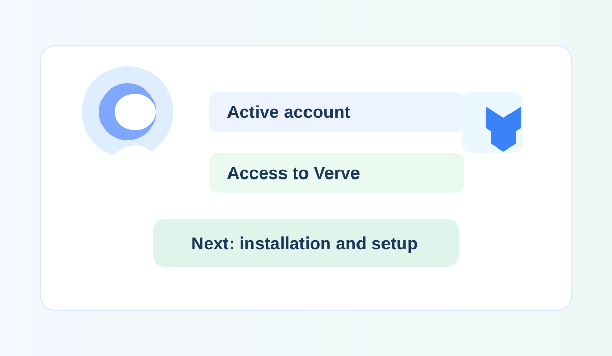

# Getting Started

Welcome to the getting-started guide for Verve.

Use this guide to prepare for installation, complete the initial setup, and find answers to common questions.

## Guide contents

- [Overview](overview.md) — Learn what Verve does and how the documentation is organized.
- [Prerequisites](prerequisites.md) — Review the access, materials, and account requirements.
- [Getting Started Setup](setup.md) — Install Verve, sign in, and create your first project.
- [FAQs](faqs.md) — Find answers to common setup and first-use questions.

## Recommended path

1. Review the [prerequisites](prerequisites.md).
2. Complete the [getting started setup](setup.md).
3. Continue with the [User Guide](../user-guide/user-guide.md) for daily tasks.
4. If you administer Verve, review the [Administration guide](../administration-guide/administration.md).
 
## Next steps

After completing the setup, continue with the [User Guide](../user-guide/user-guide.md).