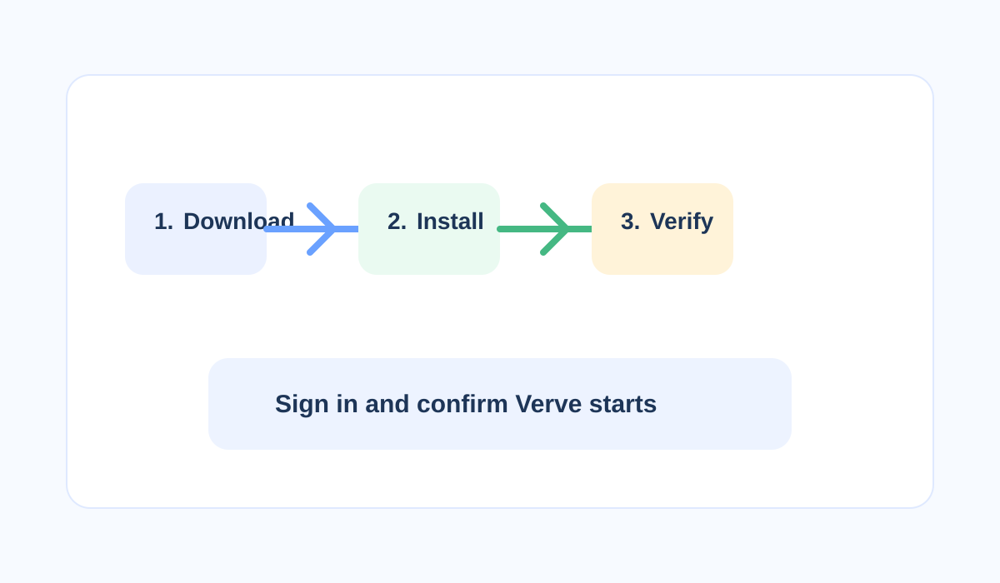

# Installation Overview

Verve is a project workspace for organizing work and collaborating with teammates. This installation guide is for installers and IT administrators. It explains how to prepare for installation, install Verve, verify that it works, and hand the installation over to the people who will use it.

## What this guide helps you do

1. Review the installation requirements.
2. Install Verve with the installation wizard.
3. Verify that Verve starts and accepts your account.
4. Continue to the User Guide or Administration Guide.

Record the installed version and any environment-specific configuration for your support team.
