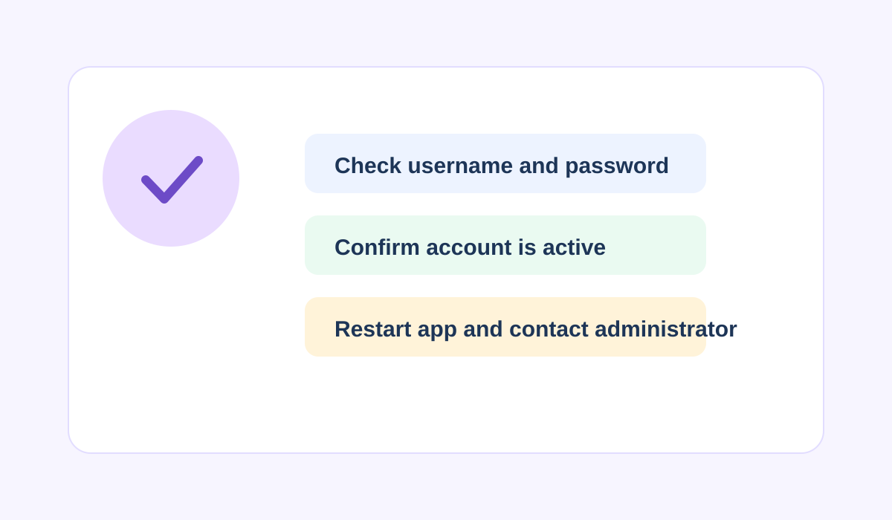
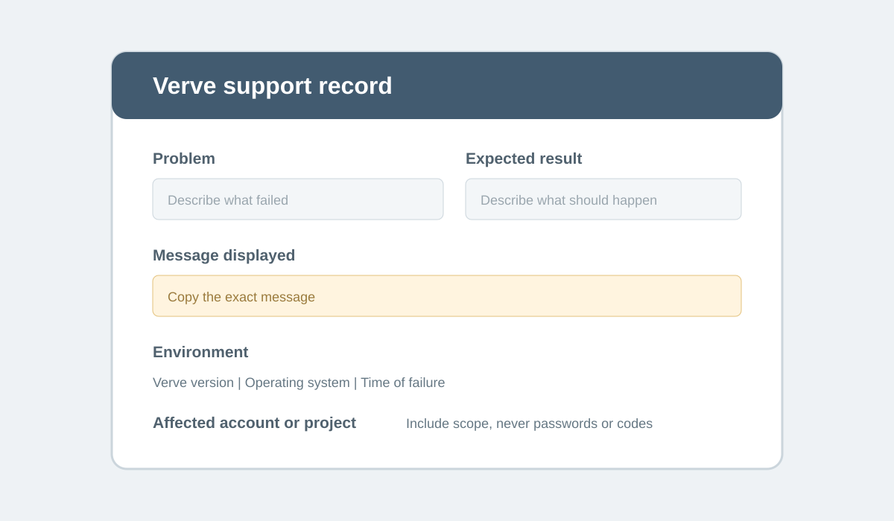

# Troubleshooting
 
Use this guide to resolve common problems with Verve. It is intended for users, administrators, and support teams. Start with the topic that best matches the problem and preserve the exact message and version information while investigating.


 
## Troubleshooting topics

- [Unable to sign in](troubleshoot-sign-in.md) — Resolve credential, account, and access problems.
- [Verve does not start](troubleshoot-startup.md) — Resolve startup and application launch problems.
- [Installation problems](troubleshoot-installation.md) — Resolve problems installing or verifying Verve.
- [Project access problems](troubleshoot-project-access.md) — Resolve project visibility and permission problems.

## Before you contact support

Record the action you attempted, the expected result, the message Verve displayed, and the steps you already tried. Include the Verve version, operating system, time of the failure, and relevant project or account details when you contact your administrator or support team. Do not share your password or other secrets.

## Diagnostic path

1. Confirm the problem is reproducible and note the exact workflow that fails.
2. Check whether the problem affects one user, one project, or all users.
3. Confirm the user's account, role, project membership, and Verve version where relevant.
4. Apply the matching troubleshooting topic and verify the result after each change.
5. Escalate with the collected details when the problem continues or affects multiple users.

## Support record

Use this template when you need to provide the same diagnostic details to an administrator or support team:



```yaml
problem: ""
expected_result: ""
message_displayed: ""
steps_already_tried: []
verve_version: ""
operating_system: ""
time_of_failure: ""
affected_user_project_or_account: ""
```

> [!WARNING]
> Do not include passwords, authentication codes, or other secrets in a support record.