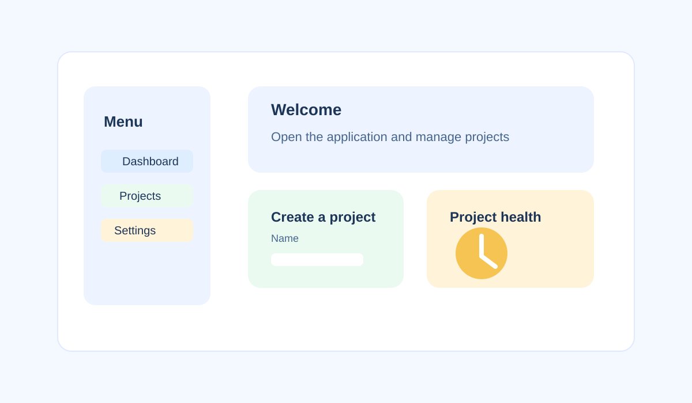

# Collaboration in Verve

Use this guide to work effectively with teammates, share updates, and keep project work moving forward.



## Share project updates

1. Open the project.
2. Select the area where you want to share information.
3. Add a project update or status note.
4. Save the update so teammates can review it.

Regular updates help the team understand the current project status and any blockers.

Use a consistent update format:

```yaml
status: on_track
completed: []
next_steps: []
owner: ""
blockers: []
```

## Assign work to teammates

1. Open the project task or item.
2. Select **Assign**.
3. Choose the team member or role.
4. Save the assignment.

Assigned work helps make responsibilities clear and keeps tasks moving forward.

Example assignment details:

```json
{
  "task": "",
  "assignee": "",
  "dueDate": "",
  "priority": "",
  "status": "not started | in progress | complete"
}
```

## Review comments and feedback

Use comments to discuss open questions, review decisions, and confirm completion. Team members can respond to comments and track discussion in one place.

## Keep projects current

| Habit | When to do it | Why it matters |
| --- | --- | --- |
| Update tasks | When work changes | Keeps status and ownership accurate. |
| Add decision notes | After an important decision | Gives teammates useful context. |
| Review the dashboard | During regular project check-ins | Surfaces outstanding work. |
| Communicate blockers | As soon as a blocker is known | Gives the team time to respond. |