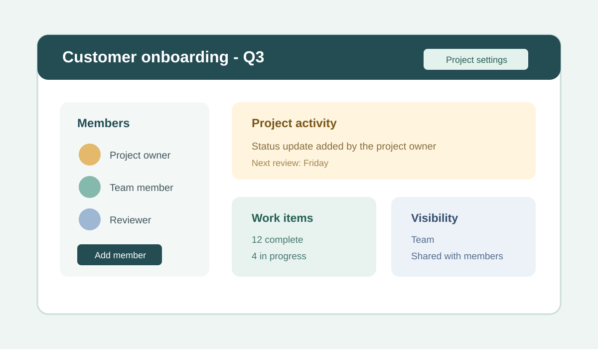

# Project Management

This guide explains how to create, manage, and maintain projects in Verve.



## Create a project

1. Open the Projects page.
2. Select **Create Project**.
3. Enter a project name that clearly describes the work.
4. Select **Create**.

After the project is created, you can begin adding content, members, and updates.

Use a name that helps teammates identify the work quickly:

```json
{
  "project": {
    "name": "Customer onboarding - Q3",
    "description": "Track onboarding tasks, owners, and status updates.",
    "visibility": "Team"
  }
}
```

## Manage project settings

1. Open the project you want to work in.
2. Select **Project settings**.
3. Review or update the project name, description, and visibility settings.
4. Save your changes when finished.

Use project settings to keep the project organized and aligned with your team’s process.

| Setting | Recommended review | Verify after saving |
| --- | --- | --- |
| Name | Is the name clear to the whole team? | The project is easy to find. |
| Description | Does it explain the work and outcome? | New members understand the purpose. |
| Visibility | Does the audience match the project need? | Only the intended users can access it. |

## Add project members

1. Open the project.
2. Select **Members**.
3. Choose **Add member**.
4. Select the user or group to assign.
5. Set their role and save the changes.

Set each member's role according to the access they need.

## Review project activity

Check the project dashboard to monitor updates, recent changes, and outstanding tasks. Reviewing the activity stream helps you stay aware of what has changed and what still needs attention.