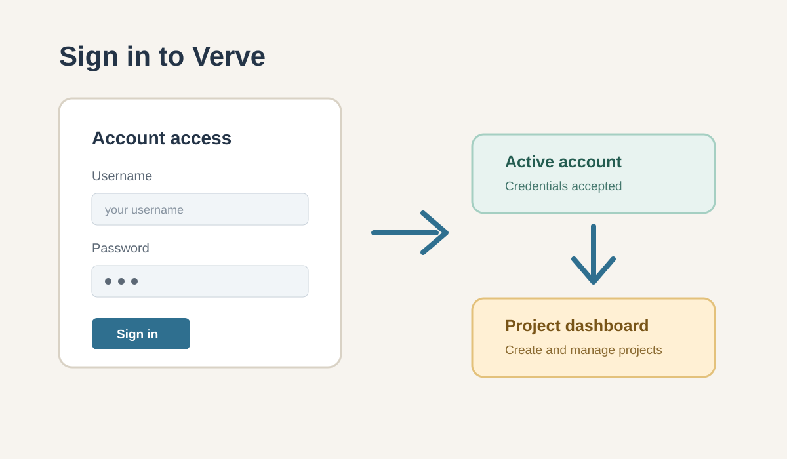

# Sign in

Use this guide to open Verve and access your account.

## Sign in to Verve

1. Open Verve.
2. Enter your username.
3. Enter your password.
4. Select **Sign in**.

> [!NOTE]
> Your account must be active before you can sign in or create a project. Contact an administrator if you are unsure of your account status.

If you are unsure of your credentials, contact your administrator.

## After you sign in

Once you sign in, you can:

- Open your project dashboard
- Create a new project
- Review work assigned to you
- Access collaboration updates and project information

## Troubleshooting

If you cannot sign in, confirm the following:

- Your username is correct.
- Your password is correct.
- Your account is active.
- Your system has internet access if required by your environment.

For additional help, contact your administrator.
