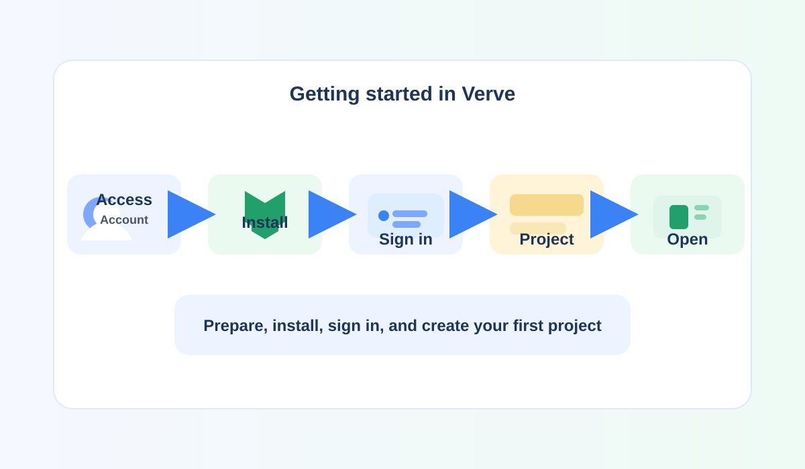

# Overview

Use this guide to prepare for installation, complete the initial setup, and create a simple first project in Verve.

## What this guide helps you do

1. Confirm that you have the access and setup information required to install Verve.
2. Install Verve and sign in with a valid account.
3. Create a project and open it for your first use.
4. Continue with the rest of the Verve guides when you are ready to do more.

## Before you begin

- Make sure your account is active before you start.
- Review the prerequisites for installation and setup.
- Ask your administrator if you need help with access or permissions.

This guide is intended for first-time users and managers who want a quick introduction to the initial Verve experience.
